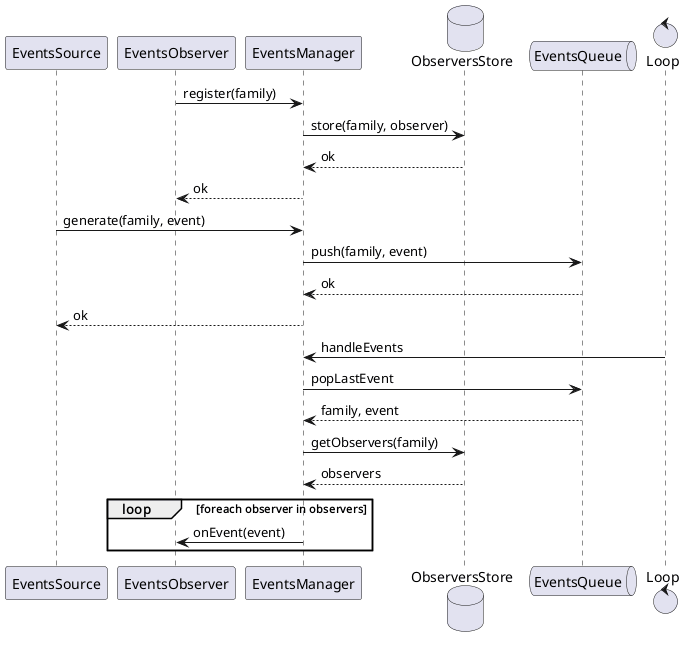
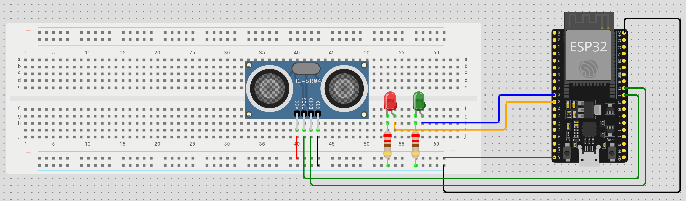
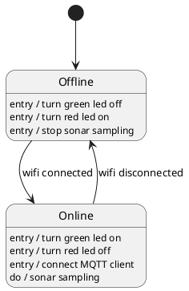
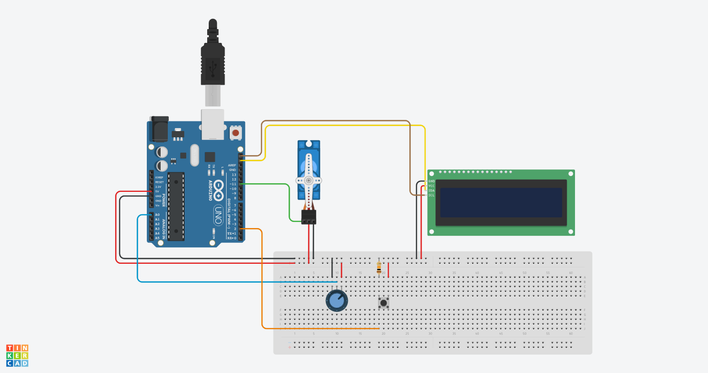
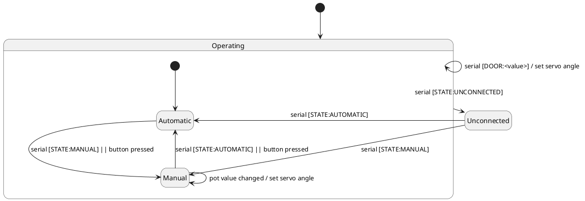
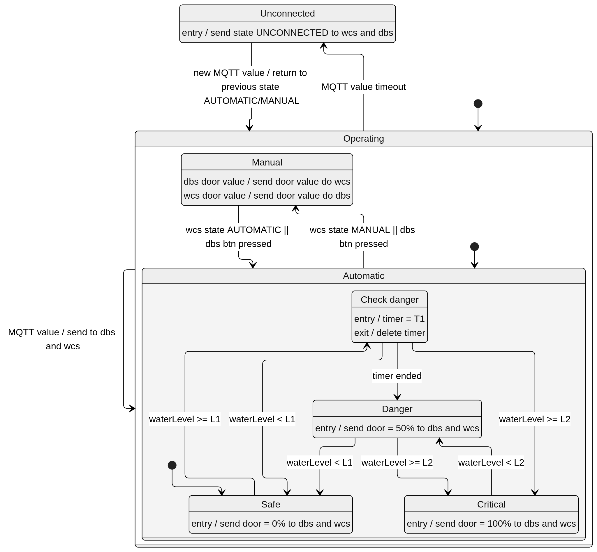
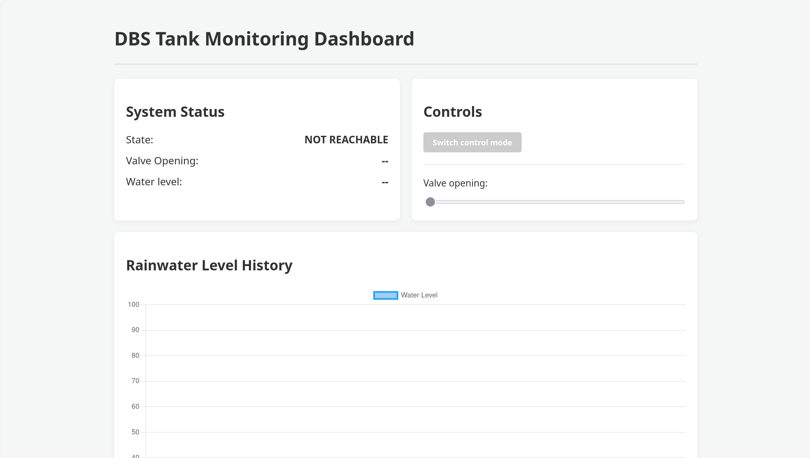
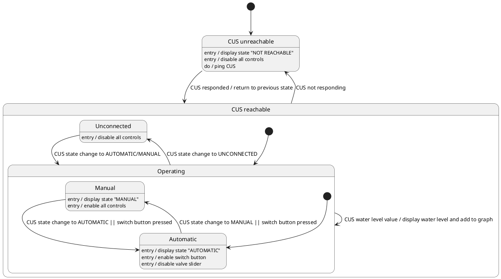

# ASSIGNMENT #03: SMART TANK MONITORING SYSTEM

_Terzo progetto del corso di Internet of Things e Sistemi Embedded_

A cura di:

- Ludovico Maria Spitaleri, mat. 0001114169
- Cristian Di Donato, mat. 0001122691

---

## 1 Introduzione

Il progetto consiste nella realizzazione di un sistema IoT per il monitoraggio del livello dell'acqua piovana in un serbatoio (tank), con controllo automatico o manuale dell'apertura di un canale di scarico verso la rete idrica.

Il sistema è composto da 4 sottosistemi principali:

- **Tank Monitoring Subsystem (TMS)**: basato su ESP32, monitora il livello dell'acqua nel serbatoio tramite un sonar e pubblica le letture al Control Unit Subsystem via MQTT.
- **Control Unit Subsystem (CUS)**: back-end in esecuzione su PC, coordina l'intero sistema, gestendo la politica di apertura del canale in base al livello dell'acqua e interfacciandosi con tutti gli altri sottosistemi.
- **Water Channel Subsystem (WCS)**: basato su Arduino, controlla l'apertura/chiusura del canale d'acqua tramite un servomotore, fornendo anche un pannello operatore locale.
- **Dashboard Subsystem (DBS)**: applicazione web/frontend per la visualizzazione remota dello stato del sistema e per l'interazione da parte degli operatori.

Tutti i sistemi sono implementati utilizzando **Asyncronous Finite State Machines (AFSM)**.

---

## 2 Architettura dei sistemi embedded

A differenza di un approccio basato su polling ciclico con funzioni di "step" eseguite periodicamente, TMS e WCS sfruttano un **gestore di eventi asincrono**, che implementa il pattern Observer in forma disaccoppiata.

### 2.1 Principio di funzionamento

Il sistema si basa su tre concetti principali:

- **Eventi**: rappresentano un evento generato da una sorgente, caratterizzato da una _famiglia_ e, opzionalmente, da un dato associato.
- **Observer**: entità che si registrano per ricevere eventi di una determinata famiglia. La registrazione avviene dichiarando la famiglia di interesse, senza conoscere quali o quante sorgenti la produrranno.
- **Sorgenti**: entità che generano eventi di una determinata famiglia, inserendoli in una coda condivisa.

Il punto cardine dell'architettura è il manager di eventi, che:

1. mantiene una coda popolata dalle varie sorgenti
2. mantiene la lista degli observer registrati
3. ad ogni ciclo di loop estrae un evento dalla coda e notifica solo gli observer la cui famiglia corrisponde a quella dell'evento

Questo disaccoppiamento tra generazione e notifica garantisce che gli observer vengano eseguiti **esclusivamente nel contesto del loop principale**, e non, ad esempio, durante un interrupt hardware; evitando quindi problemi dovuti all'esecuzione di determinate istruzioni in
contesti non standard.

### 2.2 Sorgenti sincrone e task in background

Oltre alle sorgenti "pure" che generano eventi in risposta a interrupt o callback, sono
previste anche sorgenti sincrone, pensate per integrare componenti che richiedono
una lettura dei valori manuale. Questo tipo di sorgenti espone un metodo da invocare periodicamente per verificare la presenza di nuovi eventi da generare.

Sulla piattaforma ESP32 questo controllo periodico viene delegato a una **task FreeRTOS in background**, che simula il superloop con un periodo indipendente.
Su Arduino, non disponendo nativamente di un sistema di task concorrenti, il medesimo controllo periodico viene invece integrato direttamente nel ciclo di loop.

### 2.3 Composizione delle task applicative

Le varie funzionalità applicative (es. monitoraggio della rete, lettura del sonar, gestione del display) sono quindi implementate come combinazioni di observer e sorgenti di eventi, senza la necessità di una funzione di step periodica dedicata per ciascuna di esse: ogni task si "compone" dichiarando a quali famiglie di eventi reagisce e quali eventi produce a sua volta, lasciando al gestore di eventi l'onere dello scheduling delle notifiche.

_Diagramma di sequenza del sistema di eventi utilizzato per WCS e TMS. Non viene
mostrato il caso specifico delle sorgenti sincrone per semplificare la comprensione._

---

## 3 Tank Monitoring Subsystem (TMS)

**Piattaforma:** ESP32

**Componenti hardware:**

- Board ESP32 (o ESP8266 equivalente)
- 1 sensore sonar (HC-SR04)
- 1 LED verde
- 1 LED rosso

Il TMS è responsabile della lettura continua del livello dell'acqua nel serbatoio e dell'invio di tale dato al CUS.

### 3.1 Tasks

- **NetworkTask**: si registra come observer sugli eventi di stato della connessione di rete,
  ed al variare dello stato aggiorna i due LED indicatori ed avvia la connessione
  del client MQTT se la connesione ad internet è disponibile.

- **WaterMonitoringTask**: si registra come observer sia sugli eventi del sonar sia sugli eventi di stato della rete. Alla ricezione di un evento del sonar, che opera ad una frequenza
  fissa, pubblica il valore letto sul topic MQTT dedicato al livello dell'acqua. L'observer del sonar viene abilitato/disabilitato dinamicamente in base allo stato della connessione: la lettura viene processata e pubblicata solo quando la connessione (e quindi la possibilità di pubblicare) è effettivamente attiva.

---

## 4 Water Channel Subsystem (WCS)

**Piattaforma:** Arduino UNO

**Componenti hardware:**

- Arduino UNO
- 1 servomotore
- 1 potenziometro
- 1 bottone tattile
- 1 display LCD

Il WCS controlla l'apertura/chiusura del canale d'acqua tramite un servomotore (con range 0-90°)
e fornisce un pannello locale (bottone + potenziometro) per l'interazione manuale da parte di un operatore in loco. È implementato secondo la stessa architettura a eventi del TMS (adattata per Arduino, senza task RTOS in background).

### 4.1 Tasks

**SystemStateTask**: osserva le sorgenti che possono richiedere un cambio di modalità di sistema (`AUTOMATIC`, `MANUAL`, `UNCONNECTED`), ovvero il bottone fisico e i messaggi seriali di tipo `STATE` provenienti dal CUS. Produce un evento unificato di stato di sistema solo quando il nuovo stato richiesto differisce da quello corrente, evitando notifiche ridondanti.

**ControlTask**: gestisce il servomotore in risposta ai comandi ricevuti dalle sorgenti di controllo della porta, ovvero il potenziometro ed i messaggi seriali di tipo `DOOR` provenienti dal CUS.
È inoltre observer degli eventi sullo stato del sistema, e in risposta a essi abilita/disabilita dinamicamente gli observer pertinenti:

- `UNCONNECTED`: tutti gli observer di controllo vengono disabilitati.
- `MANUAL`: viene abilitato sia l'ascolto dei comandi seriali per il controllo dal DBS
  sia del potenziometro.
- `AUTOMATIC`: viene mantenuto attivo solo l'ascolto dei comandi seriali e disabilitato il potenziometro, per il controllo in base ai livelli di emergenza.

**DisplayTask**: osserva gli eventi di cambiamento di stato del sistema e di variazione del livello di apertura della porta, aggiornando di conseguenza il display LCD.

---

## 5 Control Unit Subsystem (CUS)

**Piattaforma:** PC (back-end)

Il CUS è il coordinatore centrale del sistema: riceve i dati dal TMS, applica la politica di controllo del canale d'acqua, comunica con il WCS e fornisce un'API per il DBS. Anche il CUS adotta un'architettura **event-driven**, coerente con quella delle piattaforme embedded, sfruttando in questo caso il supporto nativo agli eventi della piattaforma di esecuzione: i dati ricevuti dalle varie interfacce di comunicazione vengono inoltrati a manager centrali, i quali producono eventi a cui i vari componenti reagiscono per propagare gli aggiornamenti verso gli altri sottosistemi.

### 5.1 Funzionamento

Il sistema è composto da 3 manager per gli eventi:
- **SystemStateManager**: riceve i valori di stato del sistema e genera un evento ogni volta che lo stato cambia rispetto al precedente.
- **WaterManager**: riceve gli aggiornamenti del livello dell'acqua e genera un evento per ogni nuova lettura (anche se il valore non cambia, per garantire un flusso di dati regolare nel tempo). Inoltre, applica la politica sui livelli di soglia (L1, L2), generando eventi distinti per livello normale, di pericolo e critico, usati per la gestione automatica dell'apertura del canale.
- **DoorManager**: riceve i valori di apertura della porta e genera un evento ogni volta che il valore cambia rispetto al precedente.

A questi manager vengono forniti nuovi dati e comandi tramite le diverse API, le
quali reagiscono anche ai loro stessi eventi:
- **MQTT**: client sottoscritto al topic su cui il TMS pubblica il livello dell'acqua; ogni messaggio ricevuto viene inoltrato al `WaterManager`. Se non vengono ricevuti dati
per più di un certo periodo di tempo, viene segnalato lo stato `UNCONNECTED` al `SystemStateManager`.
- **Seriale**: il sistema resta in ascolto di nuovi messaggi dal WCS, inoltrandone il contenuto ai manager corrispondenti. Viceversa, agli eventi di cambiamento di stato e di apertura del canale generati dai relativi manager, il CUS invia i messaggi seriali corrispondenti al WCS, permettendone il controllo da remoto. Se il sistema si trova nello stato `AUTOMATIC`,
vengono anche inoltrati al WCS i comandi di apertura automatica allo scattare degli
eventi di emergenza in base alle soglie L1 ed L2.
- **HTTP**: espone endpoint REST per il DBS, per:
  - il controllo da remoto dell'apertura del canale, quando in modalità manuale.
  - il cambio di stato del sistema (`AUTOMATIC`/`MANUAL`);
  - l'ottenimento di uno snapshot dei valori correnti (stato, apertura canale, livello dell'acqua);
  - la sottoscrizione ad un canale **SSE** (_Server-Sent Events_) per la ricezione in tempo reale degli eventi generati dai manager, evitando la necessità di polling continuo da parte del DBS.

---

## 6 Dashboard Subsystem (DBS)

**Piattaforma:** Browser / PC (applicazione web)

Il DBS è un'interfaccia web a pagina singola che consente agli operatori remoti di monitorare lo stato del sistema e di interagire con esso. Mostra:

- lo stato corrente del sistema (`AUTOMATIC`, `MANUAL`, `UNCONNECTED` o `NOT AVAILABLE`).
- il valore corrente di apertura della porta.
- il valore del livello dell'acqua.
- un grafico storico dell'andamento del livello dell'acqua nel tempo.

Fornisce inoltre:

- un bottone per cambiare modalità tra `AUTOMATIC` e `MANUAL`;
- uno slider per il controllo manuale dell'apertura del canale.

### 6.2 Funzionamento

La pagina invia periodicamente un _ping_ al CUS per verificarne la raggiungibilità:

- **Se il server non è raggiungibile**: lo stato visualizzato diventa `NOT AVAILABLE` e tutti i controlli vengono disabilitati.
- **Se il server è raggiungibile**: viene richiesto uno snapshot iniziale dei dati correnti, dopodiché la pagina si sottoscrive al canale SSE del CUS per ricevere gli aggiornamenti in tempo reale e rispecchiarli sull'interfaccia, senza necessità di ulteriore polling.

A seconda dello stato del sistema vengono attivati e disattivati i vari controlli forniti:
- `UNCONNECTED`: nessun controllo è attivo in quanto l'operatore non sarebbe in grado
di avere un riscrontro del cambiamento del livello dell'acqua.
- `AUTOMATIC`: è attivo il bottone per il passaggio a `MANUAL`, ma non lo slider per
aprire la valvola manualmente.
- `MANUAL`: è attivo sia il bottone per il passaggio a `AUTOMATIC` che lo slider per
aprire la valvola manualmente.

---

## 7 Gestione coerente dello stato del sistema

Tutti i sottosistemi restano sincronizzati sui dati e sullo stato corrente tramite le rispettive forme di comunicazione (MQTT, seriale, HTTP/SSE), evitando inconsistenze tra le varie interfacce.

Sia il WCS che il DBS (e lo stesso CUS) disabilitano dinamicamente le operazioni e i controlli disponibili in base allo stato corrente del sistema:

- **`UNCONNECTED`**: tutti i controlli sono disabilitati, poiché senza il monitoraggio del livello dell'acqua non avrebbe senso controllare il canale.
- **`AUTOMATIC`**: non è possibile controllare manualmente il canale da nessuna interfaccia, ma è possibile passare alla modalità `MANUAL`.
- **`MANUAL`**: è possibile controllare manualmente il canale da qualunque interfaccia (pannello WCS o DBS), ed è possibile tornare alla modalità `AUTOMATIC`.

## 8 Demo Video

[demo video](https://liveunibo-my.sharepoint.com/:v:/g/personal/ludovico_spitaleri_studio_unibo_it/IQAV5BM6ZgjqSKCVMQgvvYLgATTiXaWBxPtMZg-IG6N4x4A?nav=eyJyZWZlcnJhbEluZm8iOnsicmVmZXJyYWxBcHAiOiJPbmVEcml2ZUZvckJ1c2luZXNzIiwicmVmZXJyYWxBcHBQbGF0Zm9ybSI6IldlYiIsInJlZmVycmFsTW9kZSI6InZpZXciLCJyZWZlcnJhbFZpZXciOiJNeUZpbGVzTGlua0NvcHkifX0&e=u9o9kv)
